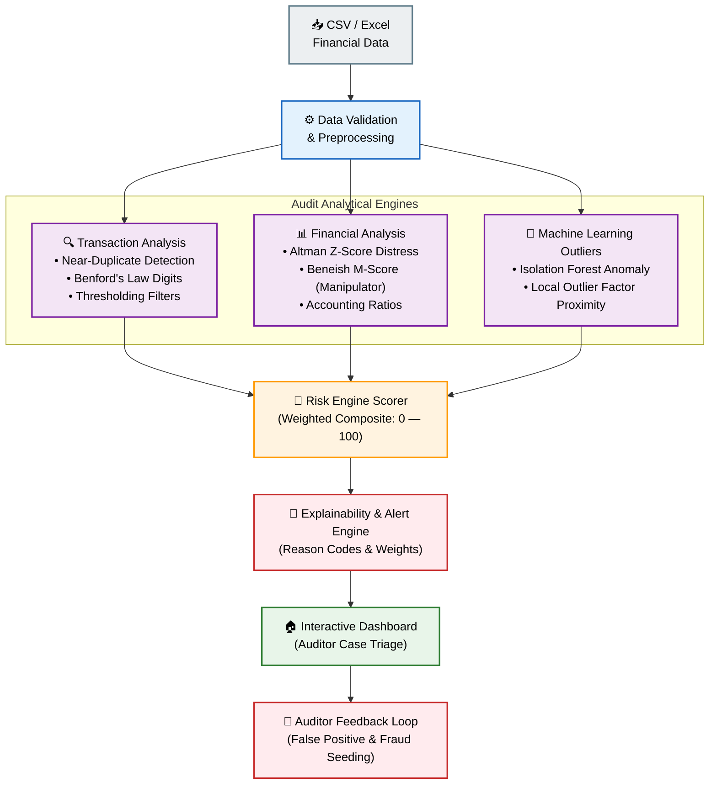

# 🔍 AuditIQ Analytics Platform

> **AI-powered fraud & anomaly detection for enterprise audit workflows.**  
> Built for Deloitte Hackathon — production-credible architecture, inspired by **Material Dashboard React** style.

[](https://python.org)
[](https://fastapi.tiangolo.com)
[](https://react.dev)
[](https://mui.com)
[](https://postgresql.org)
[](https://docs.docker.com/compose/)

---

## What it does

AuditIQ detects financial fraud and anomalies across two domains:

| Domain | What's detected |
|--------|-----------------|
| **Ledger / Vendor Payments** | Benford's Law violations · Near-duplicate invoices · PO–Invoice–GR 3-way match failures |
| **Financial Statements** | Beneish M-Score (earnings manipulation) · Altman Z-Score (bankruptcy risk) · Isolation Forest / LOF ratio anomalies |

**One shared detection core, two thin adapters.** Every exception gets a ranked score, a human-readable reason code, and a case-management status a reviewer can change live. All runs are audit-logged.

---

## Quick Start

### Option A — Docker Compose (recommended, works on Mac + Windows)

**Prerequisites:** [Docker Desktop](https://www.docker.com/products/docker-desktop/) installed and running.

```bash
# 1. Clone the repo
git clone https://github.com/TanishqAtrey/audit-analytics-platform.git
cd "audit-analytics-platform"

# 2. Copy environment file
cp .env.example .env
# Edit .env if you want custom DB credentials (defaults work fine)

# 3. Start all services (DB + backend + React frontend)
make up
# or: docker compose up -d --build

# 4. Open the dashboard
open http://localhost:3000        # macOS
# or navigate to http://localhost:3000 in your browser
```

The first `make up` takes ~2 minutes to pull images and build. Subsequent starts are fast.

| Service | URL |
|---------|-----|
| **React Dashboard (MUI)** | http://localhost:3000 |
| **FastAPI Backend** | http://localhost:8000 |
| **API Docs (Swagger)** | http://localhost:8000/docs |
| **PostgreSQL** | `localhost:5432` (user: `auditiq`, pass: `auditiq_dev`) |

---

### Option B — Local Python + Node (frontend only, no backend required)

The frontend includes full mock data fallback — every page works without a running backend.

```bash
# 1. Install dependencies
cd dashboard
npm install

# 2. Start dev server
npm run dev
# or: make run-frontend-local
```

The dashboard will open at **http://localhost:3000** and run with rich mock data fallback.

---

## Makefile Commands

```bash
make up           # Start all Docker services (detached)
make down         # Stop all services
make rebuild      # Force-rebuild images and restart
make seed         # Seed demo data into Postgres
make reset-db     # Drop + recreate + reseed (safe mid-demo)
make test         # Run full test suite
make test-backend # Backend tests only
make logs         # Tail all service logs
make benchmark    # Run parallelism benchmark (generates benchmark lift stats)
make shell-backend# Shell into backend container
make shell-db     # psql shell into Postgres
make help         # List all available targets
```

---

## System Architecture & Workflow



---

## Project Structure

```
audit-analytics-platform/
├── backend/              # FastAPI detection engine
│   ├── api/              # Routes: ingest, detect, cases, audit, benchmark
│   ├── core/             # Shared engine: scorer, registry, reason_codes
│   ├── adapters/         # Ledger & financial-statement adapters
│   ├── ml/               # Isolation Forest + LOF wrappers
│   ├── validation/       # Precision/recall, benchmark, cross-validation
│   └── schemas/          # Pydantic request/response contracts
│
├── dashboard/            # React + Material UI + Recharts dashboard
│   ├── package.json
│   ├── index.html
│   ├── vite.config.js
│   └── src/
│       ├── main.jsx
│       ├── App.jsx
│       ├── theme.js      # MUI v5 custom styling
│       ├── api/
│       │   └── client.js # Axios API seam + mock data fallback
│       ├── components/   # Sidebar, Navbar, StatCard, ChartCard, status chips
│       └── pages/        # Dashboard, exceptions, threshold, log, about
│
├── data_infra/           # Database, ingestion, security
│   ├── db/               # schema.sql, models.py, connection.py
│   ├── security/         # env_validation.py, input_sanitization.py
│   └── scripts/          # seed_demo_data.py, reset_db.py, benchmark
│
├── docker-compose.yml    # Orchestrates backend + frontend + PostgreSQL
├── Dockerfile.backend
├── Dockerfile.frontend
├── Makefile
├── requirements.txt
└── .env.example
```

---

## Dashboard Pages

| Page | What you can do |
|------|----------------|
| **🏠 Dashboard** | Material Dashboard style widgets, live stats, Benford distribution, run timeline, status breakdown |
| **📋 Ledger Exceptions** | Fuzzy duplicates, 3-way matches, detailed weights, inline status selection, CSV download |
| **📊 Financial Exceptions** | Beneish M-Score vs Altman Z-Score scatter map, company status triage, formula cheat sheets |
| **🎚️ Threshold Explorer** | Composed precision/recall/F1 chart, live threshold preset recommendations |
| **📈 Benchmark** | Baseline single-test vs ensemble curve lift charts and comparative dataset logs |
| **📜 Audit Log** | Traceability logging, runtime profiling, CSV export |
| **📖 Methodology** | Full architecture layout, detection accoridons, datasource metrics, in-scope details |

---
